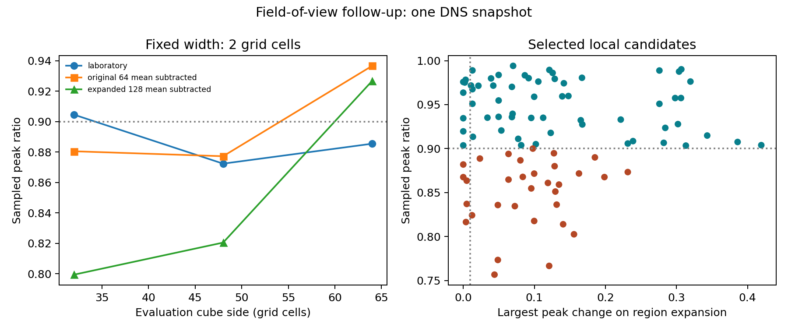

# Field-of-view follow-up to the vortex measurement note

Thomas Verdier · 9 September 2026 · Exploratory supplement to
[the v0.3.0 technical note](https://doi.org/10.5281/zenodo.22671562).

## Result

One regional sampled-peak disagreement survives the prespecified interior,
expansion, and held-out-filter screens **under the alternate, larger-volume
background subtraction**. It estimates 94.17–94.20% retention while the measured
ratio is 88.19%. The same candidate's reference and base filtered maximum remain
unchanged when its evaluation region grows from 25 to 33 and then 41 cells per
side. Direct kernel summation independently reproduces all five filtered maxima.

The original frames give a different outcome: three laboratory-frame assessments
pass the screen, with no false reassurance at the 90% decision threshold; none
pass in the original-background frame. Thus the surviving failure is specifically
a background-sensitivity result, not an independent replication or a demonstrated
hidden-core event in turbulence.

## Prospective rules and data

[PROTOCOL.md](PROTOCOL.md) was frozen at 09:22:26 UTC before acquisition and
analysis of the larger sample. Its SHA-256 is
`dbd0dcd426433113380d96d31fd6521d1ec361899258266ad194bfdccefc786f`.
This was not an external preregistration. The protocol extends a previously
explored snapshot and the analyses remain exploratory.

The new cutout contains 128³ native velocity vectors, eight times the earlier
64³ volume. It comes from the same pinned public JHTDB mirror and time index.
Its central 64³ overlap matches the earlier float32 data exactly. Acquisition
transferred 57,671,680 bytes, with provenance and hashes recorded in
[extended_provenance.json](data/extended_provenance.json). Source arrays are not
included here. The original source is [JHTDB](https://turbulence.pha.jhu.edu/);
the [public mirror](https://huggingface.co/datasets/ArielLubonja/johns-hopkins-turbulence-database)
is pinned to revision `9179e424e6eb75bcd89d3f608be795a633ccc1fa`.

Three frames were retained: laboratory velocity, subtraction of the original
64³ volume mean (held fixed during expansion), and subtraction of the new 128³
volume mean. Changing the subtracted vector changes the speed observable.

Native local speed maxima with positive Q were selected before fitting, with
adequate boundary margin and at least 16-cell separation. There were 7, 8, and 8
selected candidates in the respective frames. Some candidates recur across
frames; widths, frames, and nearby events are correlated. These 23 selections
must not be described as 23 independent vortices.

## Prespecified event comparison

Four Gaussian widths were tested for each selected candidate. The main screen
requires all six maxima (native plus five filtered) to lie at least four cells
inside the 33³ region, to change by at most 1% on expansion from 25³ to 33³, and
the two held-out-filter peaks to miss the fitted model interval by no more than
1% of the native reference peak. These rules are an empirical screen, not a proof
of profile adequacy or a certified measurement error budget.

| Frame | Correlated assessments | Raw false reassurance | Pass field-of-view rules | Pass full 1% screen | False reassurance among passes |
| --- | ---: | ---: | ---: | ---: | ---: |
| Laboratory | 28 | 7 | 5 | 3 | 0 |
| Original 64³ mean subtracted | 32 | 13 | 0 | 0 | 0 |
| Expanded 128³ mean subtracted | 32 | 12 | 2 | 2 | 1 |
| Total | 92 | 32 | 7 | 5 | 1 |

All 92 raw fits returned 'resolved'. The full screen abstained on 87. None of the
five passing cases had its measured ratio inside the very narrow model-conditional
retention interval, even when the binary resolved/underresolved decision agreed.
This distinction between a correct threshold decision and accurate interval
coverage matters.

The preplanned 0.5% sensitivity screen leaves one assessment and no false
reassurance; the 2% screen leaves seven assessments and two false reassurances.
These are descriptive counts. They are not estimates of population error rates,
and a stricter threshold was not selected retrospectively as a validated remedy.

## Audited surviving case

- Frame: expanded 128³ mean subtracted; Gaussian base width: one grid cell.
- Selected center in local z,y,x coordinates: (83,76,63).
- Native regional peak: 1.6083154884565465.
- Base-filter regional peak: 1.4183308791961946.
- Measured peak retention: 0.8818735437021287.
- Model-conditional retention interval: [0.9416871567496945, 0.9420328559953385].
- Smallest distance of all six maxima from a 33³ region face: five cells.
- Largest peak change between 25³ and 33³: zero at stored numerical precision.
- Held-out miss: 0.98534% of the native peak, just inside the 1% screen.
- Largest four-sigma versus six-sigma truncation change for this assessment:
  0.0017281% of its native peak.

After observing this case, an additional **post-outcome** audit expanded its
region to 41³. The reference and base peak remained unchanged; their distances
from a face became 11 and 10 cells. The independent direct-summation calculation
agreed with the filtering implementation within 8.55e-15 in every velocity
component at the five peak locations. The audit resolves an implementation and
local boundary concern for this case. It does not establish continuum convergence
or global peak retention.

## Original-region expansion

The earlier central region was expanded from 32³ to 48³ to 64³ while preserving
the original background. Its sampled ratio at width two changes from 0.88045 to
0.87720 to 0.93659. The native reference changes materially and returns to a
boundary maximum at 64³. None of these nested central comparisons passes the
reference stability rule. The earlier boundary-associated failure therefore
remains unsuitable as a stable reference example.



## Controls and limits

The Q implementation returns +1 for solid rotation and -1 for pure strain.
Analytic single-vortex controls produce the expected resolved and underresolved
decisions, and their held-out peaks lie inside the predicted intervals. A sampled
convolution check agrees with an analytic single-vortex continuum peak to about
8.52e-10 relative error for that particular test.

The broad-plus-narrow positive failure control, sampled at 0.125 spacing with a
0.5-radius core, retains approximately 29.99% while the fit declares 'resolved'.
Its two held-out-filter peaks lie inside the predicted intervals. This control
shows why the extra filters cannot certify that a hidden core is absent. The
control uses exact analytic Gaussian filtering followed by peak sampling; it is
not a new DNS observation or a full sampled-convolution experiment.

The largest truncation sensitivity across all event assessments was 4.53e-5 of
the reference peak. This checks kernel truncation only. Finite native spacing,
interpolation, vortex orientation, profile mismatch, and choice of background
remain unresolved. The selected centers use Q as a screening criterion, not as
proof that each evaluation region is a single vortex. No independent DNS
realization or experimental PIV dataset was evaluated, and no prevalence claim
or binomial uncertainty interval is justified.

## Reproduce

From the parent `vortex-observability` project, install its listed requirements
and acquire its existing cached 64³ sample first, then run:

```bash
python acquire_public_sample.py
python followup_20260909/acquire_extended.py
python followup_20260909/analyze.py
python followup_20260909/audit_case.py
```

The first two commands access attributed public source data. Analysis and audit
run locally from the cache. `data/` includes the frozen-plan receipt, provenance,
all inclusion and exclusion outcomes, peak locations, controls, and audit result.
The original v0.3.0 deposit has not been changed. This supplement was developed
with Codex assistance and has not been externally refereed.
