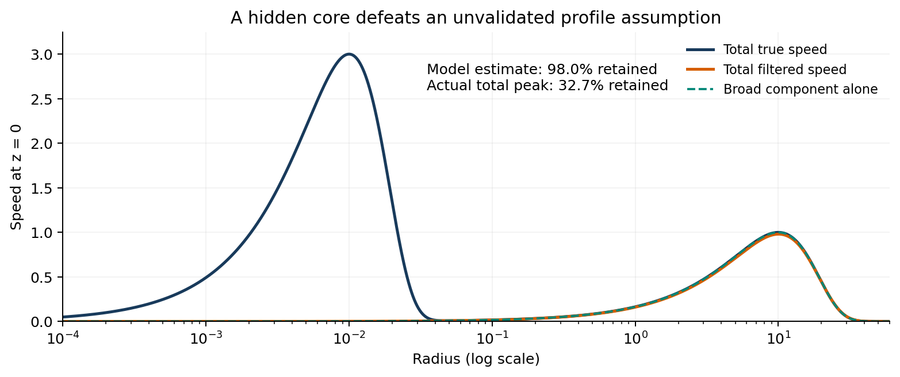
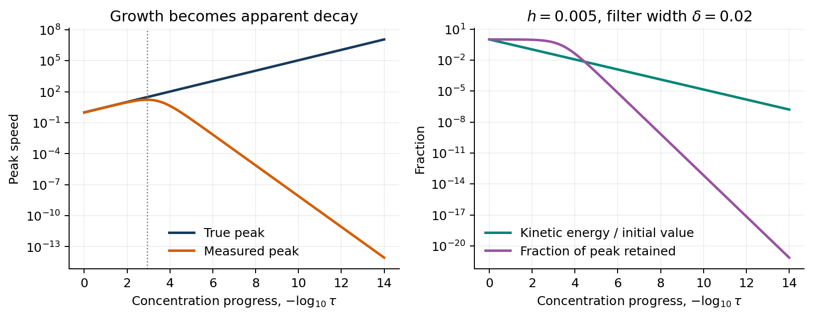
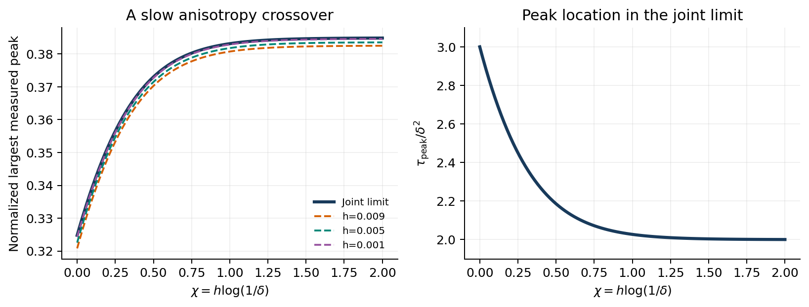
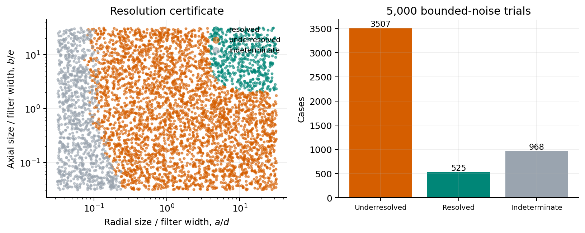
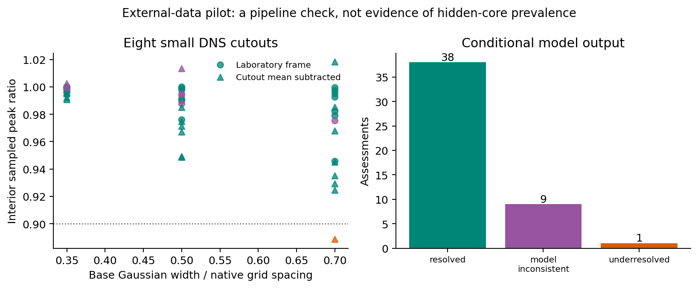
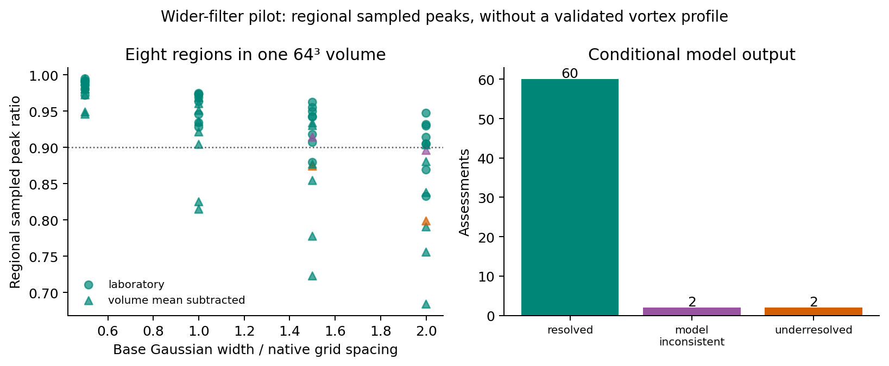

# Hidden vortex cores and false confidence in measurement resolution

## Exact Gaussian filtering, conditional certificates, and a reproducible benchmark

**Thomas Verdier**  
Independent researcher, Charleston, South Carolina  
Working research manuscript, version 0.3, 9 September 2026

### Abstract

We analyze Gaussian measurements of a smooth, divergence-free vortex whose spatial scales contract while its peak velocity increases. Exact convolution yields a joint anisotropy-resolution crossover: reversing two orders of limits changes the normalized maximum measured peak by 32/27. The true peak diverges while every fixed smooth observation kernel with bounded derivatives produces a vanishing signal. Three directional peak measurements yield deterministic scale and retention intervals conditional on a single Gaussian profile. An explicit two-component counterexample shows why this condition matters: measurements consistent with approximately 98% retention can represent a flow retaining only 32.7% of its actual peak. We also derive an elementary, profile-independent necessary resolution bound from energy and peak-growth estimates. Independent quadrature, high-precision optimization checks, and 5,000 bounded-noise trials support the calculations. Exploratory DNS pilots additionally show that conditional model decisions can disagree with regional sampled peak ratios; profile and field-of-view effects remain unresolved. These are results for a kinematic benchmark, with a limited conditional application to reported Navier-Stokes growth estimates; the Gaussian crossover is not established for that complete flow.

### 1. Motivation and scope

OpenAI's September 2026 manuscript reports a forced, finite-energy Navier-Stokes blowup construction. Its leading-core radial scale, axial scale, and characteristic velocity scale are proportional to powers of the time remaining before concentration: respectively tau^(1/2), tau^(1/2-h), and tau^(-1/2-h), with a small positive h [1, Section 2]. These exponents motivate the benchmark below. We use them as an explicit mathematical parameterization; none of our proofs assume the validity of that construction.

The distinction between an unbounded continuum velocity and a bounded measurement is elementary but consequential. For any velocity u in L2 and kernel K in L2, Cauchy-Schwarz gives

$$
\|K*u\|_\infty\leq \|K\|_2\|u\|_2. \tag{1}
$$

Consequently, a uniformly bounded-energy flow always has a bounded filtered velocity at each fixed kernel width. Equation (1) does not imply that its filtered signal vanishes or identify the resolution needed to measure the peak.

Spatial filtering of measured vortices has substantial prior literature. Rahgozar, Maciel and Schlatter study spatial-resolution effects on vortex characterization in planar particle image velocimetry (PIV) [2]. Deem and colleagues correct smoothing caused by vortex wandering using deconvolution [3]. Gaussian scale selection has a mature theory [4], and the distinction between continuous and discretized Gaussian operations is quantitatively important [5]. Numerical investigations of fluid singularities also depend on the interaction of geometric scales, computation, and analysis [6]. Recent learned reconstructions of PIV vortex flows provide another comparison point [7].

The closest analytic comparison is Lindeberg's treatment of anisotropic Gaussian blobs and exact extrema over scale [8, Sections 3.3 and 5.2]. Accordingly, Gaussian closure, anisotropic scale optimization, width recovery, and deconvolution instability are not claimed as new. The narrower contribution is the explicit joint limit along the selected concentration path, accompanied by reproducible conditional diagnostics and a hidden-core counterexample. The observables differ: [8] studies image differential responses, while here we maximize filtered vector speed over space and concentration time. A targeted search found no exact prior instance of the 32/27 result; this does not establish priority. We position the work as a methods and benchmark note.

**Scope.** This is an observation-theory benchmark. It is not a solution of the forced Navier-Stokes problem, an implementation of the oscillatory corrections in [1], or a model of an entire PIV acquisition pipeline. Filter widths denote Gaussian standard deviations, not mesh spacings. All spatial norms below use the Euclidean vector norm, and spatial peaks are continuum suprema. Discrete sampling error is an additional measurement error.

### 2. An explicit solenoidal concentration family

Let a,b,U be positive. With x=(x1,x2,z), define

$$
\phi_{a,b}(x)=\exp\!\left(-\frac{x_1^2+x_2^2}{2a^2}-\frac{z^2}{2b^2}\right),
\qquad
u_{a,b,U}(x)=\frac{\sqrt{e}\,U}{a}(-x_2,x_1,0)\phi_{a,b}(x). \tag{2}
$$

For tau>0 and 0<=h<0.01, set

$$
a=\tau^{1/2},\qquad b=\tau^{1/2-h},\qquad U=\tau^{-1/2-h}. \tag{3}
$$

The endpoint h=0 is an isotropic comparison family. Each field is smooth, rapidly decreasing and divergence-free. Its flow direction is purely azimuthal. In particular, it does not reproduce radial inflow, axial stretching, or the nonlinear stress corrections of [1].

**Proposition 1 (peak and energy).** The family (2) satisfies

$$
\nabla\cdot u=0,\qquad \|u\|_\infty=U,\qquad
E:=\frac12\int_{\mathbb R^3}|u|^2\,dx
=\frac{e\pi^{3/2}}2 U^2a^2b. \tag{4}
$$

Under (3), E=(e*pi^(3/2)/2) tau^(1/2-3h), whereas the peak is tau^(-1/2-h).

*Proof.* The derivatives of the two nonzero components cancel in the divergence. At fixed z, the speed is proportional to r exp(-r^2/(2a^2)), with maximum at r=a; the maximum in z occurs at zero. The factor sqrt(e) makes this peak exactly U. In cylindrical coordinates, integration uses int_0^infinity r^3 exp(-r^2/a^2) dr=a^4/2 and int_R exp(-z^2/b^2) dz=sqrt(pi)b. This gives (4). Substitution of (3) gives the exponents. QED.

**Dynamical distinction.** The prescribed family cannot be maintained by a force smooth through tau=0. Set t=1-tau and viscosity nu>0. At r=a,z=0, its azimuthal momentum balance requires the angular mean of the azimuthal force to be

$$
\langle f_\theta\rangle_\theta
=U\left[\frac{1/2+h+3\nu}{\tau}+\nu\tau^{-1+2h}\right]. \tag{4a}
$$

Indeed, the azimuthal material derivative here is partial_t u_theta=(1/2+h)U/tau, and the azimuthal component of the vector Laplacian is -(3/a^2+1/b^2)U. The angular average of an azimuthal pressure derivative is zero. Expression (4a) diverges at points approaching the origin. This verifies that the benchmark studies observation effects separately from smooth-force Navier-Stokes dynamics.

### 3. Fixed-kernel disappearance and a noise obstruction

Write grad_perp K=(partial_2 K,-partial_1 K,0), and let C0=sqrt(e)(2pi)^(3/2). For a scalar kernel K with bounded derivatives through order three, define H_K as the supremum of the bilinear operator norm of D^2 grad_perp K.

**Theorem 2 (a dipole observation limit).** If K is integrable, C3, and has bounded derivatives through order three, then

$$
\|K*u-C_0Ua^3b\,\nabla_\perp K\|_\infty
\leq \frac{C_0}{2}Ua^3b(2a^2+b^2)H_K. \tag{5}
$$

If grad_perp K is nonzero and a,b tend to zero, then

$$
\|K*u\|_\infty\sim C_0Ua^3b\|\nabla_\perp K\|_\infty. \tag{6}
$$

For (3), Ua^3b=tau^(3/2-2h); hence the filtered signal vanishes uniformly while the true peak diverges.

*Proof.* From (2), u=sqrt(e)Ua grad_perp phi. Moving the derivative onto K by integration by parts yields K*u=C0Ua^3b E[grad_perp K(x-Y)], where Y is centered Gaussian with covariance diag(a^2,a^2,b^2). Taylor-expand grad_perp K at x. The first-order term has zero expectation. The vector remainder is bounded by H_K |Y|^2/2, whose expectation is H_K(2a^2+b^2)/2. This proves (5). The reverse triangle inequality for the supremum norm proves (6). QED.

The additional factor a in Ua^3b reflects cancellation of oppositely directed velocities across the vortex. Filtering the vector velocity and then taking its magnitude differs from filtering the scalar speed. All results here use the former observation convention.

**Corollary 3 (bounded-noise indistinguishability).** Consider any finite collection of fixed kernels satisfying Theorem 2. Suppose each complete filtered velocity field is observed with additive error bounded by sigma>0 in the supremum norm. For all sufficiently small tau, there is an observation compatible both with u_tau and with the zero field. Any peak estimator based only on that snapshot has worst-case absolute error at least U(tau)/2 over these two possibilities.

*Proof.* For small tau all filtered norms are at most 2sigma. The collection of half-signals y_j=(K_j*u_tau)/2 is within sigma of both the zero observation and the signal. An estimate p based on this common observation must satisfy max(|p|,|p-U|)>=U/2. QED.

This is a noise-stability obstruction, not a failure of injectivity for noiseless Gaussian convolution. It assumes snapshot data and does not exclude inferences using additional dynamics, a known trajectory, or restrictive prior information.

### 4. Exact Gaussian measurements and apparent decay

Let d and eta be positive radial and axial observation widths. Define the normalized Gaussian

$$
G_{d,\eta}(x)=\frac{\exp[-(x_1^2+x_2^2)/(2d^2)-z^2/(2\eta^2)]}
{(2\pi)^{3/2}d^2\eta}. \tag{7}
$$

**Theorem 4 (exact transfer function).** Put A=sqrt(a^2+d^2), B=sqrt(b^2+eta^2). Then G*u is exactly the field (2) with parameters A,B,M, where

$$
M=U\left(1+\frac{d^2}{a^2}\right)^{-3/2}
\left(1+\frac{\eta^2}{b^2}\right)^{-1/2}. \tag{8}
$$

*Proof.* Gaussian convolution gives G*phi=(a^2b/(A^2B))exp[-r^2/(2A^2)-z^2/(2B^2)]. Applying sqrt(e)Ua grad_perp yields sqrt(e)Ua^3b(-x2,x1,0)exp[-r^2/(2A^2)-z^2/(2B^2)]/(A^4B). Its speed is maximal at r=A,z=0, proving (8). QED.

For fixed d,eta and (3), the late-concentration asymptotic is

$$
M\sim d^{-3}\eta^{-1}\tau^{3/2-2h}. \tag{9}
$$

For a more general family a=tau^alpha, b=tau^beta, U=tau^(-gamma), differentiating (8) gives

$$
\frac{d\log M}{d\log\tau}=-\gamma+
\frac{3\alpha d^2}{\tau^{2\alpha}+d^2}+
\frac{\beta\eta^2}{\tau^{2\beta}+\eta^2}. \tag{10}
$$

When alpha,beta,gamma>0 and gamma<3alpha+beta, the right side strictly decreases with tau from a positive value to a negative one. Thus M has exactly one maximum on tau>0. As concentration proceeds toward tau=0, the measured peak first rises and then falls, despite continuing growth of U. A physical time interval such as 0<tau<=1 contains this maximum when the observation widths are sufficiently small.

### 5. A singular anisotropy-resolution crossover

We now take d=eta=delta and use (3). Let M_h(tau,delta) denote (8), and define

$$
P_h(\delta)=\delta^{1+2h}\sup_{\tau>0}M_h(\tau,\delta). \tag{11}
$$

**Theorem 5 (noncommuting limits).** The two iterated limits exist and satisfy

$$
\lim_{h\downarrow0}\lim_{\delta\downarrow0}P_h(\delta)
=\frac{2}{3\sqrt3},\qquad
\lim_{\delta\downarrow0}\lim_{h\downarrow0}P_h(\delta)
=\frac{3\sqrt3}{16}. \tag{12}
$$

Their ratio is 32/27, or approximately 1.185185. More precisely, if h and delta tend to zero with h log(1/delta) tending to chi>=0, then

$$
P_h(\delta)\longrightarrow C(\chi)
=\frac{s_*^{3/2}}{(s_*+1)^{3/2}(s_*+e^{-4\chi})^{1/2}},
\qquad s_*=1+\sqrt{1+3e^{-4\chi}}. \tag{13}
$$

The maximizing concentration time obeys tau_peak/delta^2 -> s_* in this joint limit.

*Proof.* Set tau=delta^2 s and chi=h log(1/delta). The normalized response is exactly

$$
F_{h,\chi}(s)=s^{-1/2-h}(1+s^{-1})^{-3/2}
(1+e^{-4\chi}s^{-1+2h})^{-1/2}. \tag{14}
$$

For h tending to zero and chi tending to a fixed nonnegative value, (14) converges locally uniformly on s>0 to

$$
F_\chi(s)=\frac{s^{3/2}}{(s+1)^{3/2}(s+e^{-4\chi})^{1/2}}. \tag{15}
$$

The convergence passes to maxima: for 0<s<=1 and 0<=h<=h0<0.01, F is at most s^(1-h0); for s>=1 it is at most s^(-1/2). These bounds make both tails uniformly negligible. Differentiating log(F_chi^2) gives 3/s-3/(s+1)-1/(s+exp(-4chi)); its unique zero is s_* in (13). Uniqueness and local uniform convergence also give convergence of maximizers.

For fixed h>0, sending delta to zero in (14) removes its last factor. The limiting maximum occurs at c_h=3/(1+2h)-1, and has value

$$
c_h^{-1/2-h}\left(\frac{c_h}{1+c_h}\right)^{3/2}. \tag{16}
$$

Sending h to zero gives 2/(3sqrt(3)). In the reverse order, h=0 gives F=s^(3/2)/(s+1)^2, whose maximum is at s=3 and equals 3sqrt(3)/16. This proves (12). QED.

For 0<tau<=1 the same small-delta limits apply, because the maximizing tau is of order delta^2. The crossover can be extremely slow: the factor controlling it is delta^(4h), so small positive anisotropy cannot generally be treated as either fully isotropic or fully separated at accessible resolutions. The factor 32/27 describes the normalized maximum over concentration time, not the instantaneous attenuation at a fixed time.

### 6. A resolution certificate from three observations

Assume that the isolated vortex component is described by (2), with unknown positive a,b,U but known observation widths. Let M0 be the peak at widths (d,eta), Mr the peak at (kappa*d,eta), and Mz the peak at (d,kappa*eta), where kappa>1. Define

$$
Q_r=(M_0/M_r)^{2/3},\qquad Q_z=(M_0/M_z)^2.
\tag{17}
$$

**Proposition 6 (exact scale recovery).** The scale parameters satisfy

$$
a^2=d^2\frac{\kappa^2-Q_r}{Q_r-1},\qquad
b^2=\eta^2\frac{\kappa^2-Q_z}{Q_z-1},\qquad 1<Q_r,Q_z<\kappa^2. \tag{18}
$$

The amplitude then follows from (8). This requires no value for tau or h.

*Proof.* Ratios cancel U and the unchanged directional attenuation. Raising to the exponents in (17) leaves (a^2+kappa^2 d^2)/(a^2+d^2), and the analogous expression for b. Rearranging gives (18). QED.

The coarser fields can be produced by additionally smoothing the base field with radial or axial standard deviation sqrt(kappa^2-1) times the base width. This operation does not restore information lost in the base observation. The inversion uses the assumed family; it becomes ill-conditioned as Q approaches either endpoint.

**Deterministic error intervals.** Let the observed base and coarser peaks be m0,m1, with known absolute errors eps0,eps1. If both observed peaks exceed their respective errors, then the true ratio belongs to

$$
\left[\frac{m_0-\epsilon_0}{m_1+\epsilon_1},
\frac{m_0+\epsilon_0}{m_1-\epsilon_1}\right]. \tag{19}
$$

Raise both endpoints to 2/3 for a radial comparison or 2 for an axial comparison. Intersect with the admissible interval (1,kappa^2), then map through the decreasing function F_w(Q)=w sqrt((kappa^2-Q)/(Q-1)). Reversing the endpoints gives a rigorous radius enclosure. An interval touching Q=kappa^2 has lower radius bound zero; one touching Q=1 has upper bound infinity. If a denominator cannot be separated from zero, return [0,infinity]. An empty admissible intersection reports inconsistency with the model and stated error bounds.

Let [aL,aH] and [bL,bH] be the resulting enclosures, and define

$$
R(a,b)=(1+d^2/a^2)^{-3/2}(1+\eta^2/b^2)^{-1/2}. \tag{20}
$$

Because R increases in both arguments, a target retention rho is certified if R(aL,bL)>=rho. Underresolution is certified if R(aH,bH)<rho. Otherwise the result is indeterminate. The conventions are R=0 if either size is zero, and w^2/infinity=0. These are conservative statements conditional on the vortex model and valid error bounds.

**Arithmetic and scope.** Ordinary floating-point evaluation need not enclose exact endpoints, even with zero measurement error. For example, the radial inputs m0=27, m1=8, d=1, kappa=2 give a=sqrt(7/5); a collapsed interval at its rounded value misses that exact radius. The revised implementation treats supplied numbers as exact rational inputs, encloses radial cube roots by rational bisection, and verifies outward-rounded radius endpoints by exact squared comparisons. Retention decisions also use exact rational squared comparisons. This establishes conservative arithmetic enclosures for the supplied inputs; upstream computation and measurement errors must still be included. Three peaks determine three model parameters and cannot independently validate the profile or exclude an unresolved component.

### 7. Model error and transfer to a complete flow

Suppose the observed flow is u+w. For each Gaussian filter,

$$
\big|\|G*(u+w)\|_\infty-\|G*u\|_\infty\big|
\leq\|G*w\|_\infty\leq
\frac{\|w\|_2}{\sqrt{8\pi^{3/2}d^2\eta}}. \tag{21}
$$

Thus a proved L2 bound on w can be added to the observation-error budget after multiplication by the explicit factor in (21). The ensuing certificate concerns the modeled component u; it is not automatically a certificate for the total flow's peak.

Relative smallness in energy is insufficient to preserve the leading measured signal. Let v be a fixed, nonzero smooth Gaussian vortex and w_tau=tau*v. Under (3),

$$
\frac{\|w_\tau\|_2}{\|u_\tau\|_2}\asymp\tau^{3/4+3h/2}\to0,
\qquad
\frac{\|G*w_\tau\|_\infty}{\|G*u_\tau\|_\infty}
\asymp\tau^{-1/2+2h}\to\infty. \tag{22}
$$

This follows directly from Proposition 1, Theorem 2, and linearity of filtering. A correction negligible relative to the core's L2 norm can dominate its fixed-resolution observation. To carry (9) over to a complete construction, one needs direct filtered-error control, cancellation estimates, or the sufficient condition ||w||2=o(Ua^3b) at fixed widths. A regular exterior background must also be accounted for. The complete solution may have a nonzero filtered background even when an isolated concentrating component disappears.

**Proposition 7 (a necessary resolution bound without a profile assumption).** Suppose a velocity family v_tau satisfies ||v_tau||2<=B and ||v_tau||infinity>=c tau^(-gamma), where B,c,gamma are positive constants. If a Gaussian observation retains a fraction at least rho of the actual peak, with 0<rho<1, then

$$
d^2\eta\leq\frac{B^2\tau^{2\gamma}}{8\pi^{3/2}\rho^2c^2}.
\tag{23}
$$

For isotropic width delta, this requires delta<=C tau^(2gamma/3), where C is the cube root of B^2/(8pi^(3/2)rho^2c^2). At fixed widths, the actual retained fraction is at most B tau^gamma/(c sqrt(8pi^(3/2)d^2 eta)), and hence tends to zero.

*Proof.* Direct integration gives ||G||2=(8pi^(3/2)d^2 eta)^(-1/2). The retention assumption and (1) imply rho c tau^(-gamma)<=rho ||v_tau||infinity<=||G*v_tau||infinity<=B||G||2. Squaring and rearranging yields (23). Dropping the retention assumption and dividing (1) by the peak lower bound gives the last assertion. QED.

This is an elementary consequence of an established energy inequality. It is necessary, generally not sharp, and gives no sufficient sampling rule or absolute disappearance result.

**What transfers to [1].** Theorem 3.1(iv), equation (3.6), and the localized growth path (10.21) give the required peak lower bound with gamma=1/2+h and c=e0/2 at sufficiently small tau. Lemma 10.4 permits B=F(1). Conditional on those results, (23) therefore requires delta<=C tau^((1+2h)/3). Their pointwise growth estimate does not supply our Gaussian observation law. Their profiles, exterior field, and corrections differ, and their fixed-parameter bounds do not provide the h-uniform control needed for Theorem 5 [1, Sections 3.1 and 3.6]. Thus (23), rather than 32/27 or (9), is the justified connection to the complete flow.

**A hidden-core counterexample.** Add two concentric, co-rotating copies of (2): a broad component with (a,b,U)=(10,10,1) and a narrow component with (a,b,U)=(0.01,0.01,3). Take filter widths (1,1), (2,1), and (1,2). The narrow component's L2 norm is only 9.49e-5 times the broad component's, yet it controls the true peak. Denoting the total field by v, alignment at the narrow core and the triangle inequality give

$$
\frac{\|G_{1,1}*v\|_\infty}{\|v\|_\infty}
\leq\frac{(1+0.01)^{-2}+3(1+10000)^{-2}}{3}
<0.327. \tag{24}
$$

This conclusion requires no numerical maximization. Each filtered narrow-core peak is below 3e-8. Therefore the broad component's three peaks, with absolute error bound 4e-8, are compatible with either the broad field alone or the total field. Those same data yield a single-profile retention interval [0.98029599,0.98029611] and a positive 90% certificate. It is valid for the broad component and invalid if interpreted as a certificate for the total peak. Tiny measurement errors and tiny relative L2 profile errors do not resolve this ambiguity.

Direct numerical maximization gives a total true peak of 3.001648947, a base filtered peak of 0.9802960494, and actual retention of 0.3265858422. Using all three numerically maximized peaks with error bounds 1e-12 also returns approximately 98% model retention. Equation (24) and the common-observation argument establish the failure independently of the precision of that optimizer.

### 8. Reproducible computations

The script `reproduce.py` evaluates the closed forms and performs independent numerical cross-checks; `review_audit.py` adds high-precision, boundary, and hidden-core checks. All generated data are in `data/`, and figures are in `figures/`. Calculations used Python 3.12.13, NumPy 2.3.5, SciPy 1.17.0, and Matplotlib 3.10.8. The random seed is 20260909. These synthetic checks involve no PDE integration or trained reconstruction model. A separate external DNS pilot is described below.

**Convolution checks.** Forty randomly parameterized evaluations used adaptive quadrature of the convolution integrals in source coordinates, truncated at twelve Gaussian standard deviations. The maximum vector error normalized by the exact peak was 9.87e-16. A second check filtered a sampled velocity component on 49^3, 65^3, 97^3 and 129^3 grids. The central-line values agreed with the continuum formula to less than 1.1e-15 of its peak. The finite grid still underestimated the continuum line peak by 1.62%, 0.850%, 0.0431% and 0.0245%, respectively. Agreement of convolution values therefore does not remove peak-sampling error. These are floating-point checks, not interval-arithmetic certificates.

**Concentration trajectory.** With h=0.005 and d=eta=0.02, tau ranged from 1 to 1e-14 on 1,001 logarithmically spaced points. The measured peak reached approximately 16.9346 at the sampled tau=0.00114815. At the final point the true peak was approximately 1.175e7, the measured peak 8.63e-15, and kinetic energy 1.62e-7 of its initial value. A fit on tau<1e-10 gave a measured decay exponent of 1.48999997, compared with the analytic 1.49.

**Crossover.** Numerical optimization of the exact normalized response (14), on 101 values of chi from 0 to 2, was compared with (13). Maximum relative differences in the normalized peak were 1.218%, 0.681%, and 0.137% for h=0.009, 0.005, and 0.001. These differences are finite-h effects. The analytic iterated-limit values are 0.3247595264 and 0.3849001795.

**Independent maximum audit.** An 80-digit Decimal implementation bisected the stationary equation directly in 24 cases: h in {0,0.001,0.005,0.009} and chi in {0,0.1,0.5,1,5,20}. Its peak values agreed with the SciPy optimizer to relative error at most 2.23e-16; the maximizing locations agreed within 4.0e-8 relative error. The h=0 cases also matched the closed-form crossover. These checks use different numerical methods but do not replace the proof of the joint limit.

**Bounded-noise certificate.** In 5,000 trials, a and b were independently log-uniform on [10^(-1.5),10^(1.5)], U=1, d=eta=1, and kappa=2. Each of the three exact peaks received an independent uniform perturbation in [-1e-4,1e-4]; that same absolute bound was passed to the interval algorithm. For a 90% retention target, 3,507 cases were certified underresolved, 525 resolved, and 968 indeterminate. All true sizes were enclosed. There were zero false resolved and zero false underresolved decisions. Zero observed failures are a verification result on these synthetic trials; deterministic validity follows from (19) under its assumptions.

**Boundary and arithmetic audit.** The revised enclosure algorithm passed two exact rational square-root tests, seven endpoint/noise cases, four invalid-input checks, and all eight noise corners on 28 shape pairs (224 cases), including nearly saturated ratios. The corner checks used 80-digit reference peaks and budgets including float-conversion error. All known radii and retentions were enclosed. The original 5,000 trials were rerun after the arithmetic repair with unchanged decision counts. The new hidden-core example is an intentional out-of-model failure, not one of those in-model trials.

The trials test algebra, implementation, and conservative abstention under the stated family. They do not measure performance on a turbulent flow, compare with modern PIV reconstruction methods, or establish robustness to unknown profile shape. Noise bounds on experimentally inferred peaks must incorporate interpolation, calibration, filtering, finite field of view, and background subtraction errors where relevant.

**External DNS pilot.** Eight separated 15^3 cutouts from JHTDB isotropic1024coarse [9], at time index 1, were processed in two frame conventions and at three base widths (0.35, 0.5, and 0.7 native grid spacings). All peaks were evaluated on the same central 3^3 grid region with sufficient halo for the finite filter support. Among 48 correlated assessments, the conditional algorithm returned 38 resolved, one underresolved, and nine model-inconsistent outputs. No resolved output had a regional sampled peak ratio below 0.9. Ratios ranged from 0.88863 to 1.01820; a regional ratio can exceed one when filtering imports a larger surrounding velocity. These ratios are not global continuum peak retentions.

The pilot exercises the code on an external dataset but does not validate the profile assumption, establish an error bound, or estimate hidden-core prevalence. Its tolerance of 1e-4 times the regional reference peak is a diagnostic setting. The small widths and evaluation region limit what the negative result can show. Full acquisition provenance, definitions, and a prospective study protocol accompany the release in `EXTERNAL_VALIDATION.md`, `DATA_SOURCES.md`, and `STUDY_PROTOCOL.md`.

**Wider-filter follow-up.** One public 64^3 JHTDB volume [10] allowed widths 0.5, 1, 1.5, and 2 cells, evaluated on eight nonoverlapping 16^3 regions with 16-cell halos and two frame conventions. A direct JHTDB query confirmed the mirror's 3^3 prefix exactly at float32 precision. Of 64 correlated assessments, 60 were conditionally resolved, two underresolved, and two model inconsistent. Fourteen resolved outputs had regional sampled ratios below 0.9. The largest disagreement paired a conditional interval [0.920798,0.921237] with a sampled ratio 0.684182. This is an out-of-model disagreement, not a failure of the conditional theorem or identification of a hidden core.

A post hoc field-of-view check used the full central 32^3 region. One of eight assessments still paired a resolved decision with a ratio below 0.9: [0.903977,0.904363] versus 0.880466. The reference maximum lay on the region boundary in both frame conventions. Thus profile, background, sampling, and field-of-view effects remain unresolved. These experiments support caution about applying the model without its hypotheses, but do not measure the prevalence of the analytic hidden-core mechanism. The larger event-centered study in `STUDY_PROTOCOL.md` remains prospective.

### 9. Discussion and publication scope

The main analytic result is the explicit nonuniform transition between isotropic and anisotropic observation limits. The radial transfer has power 3/2 and the axial transfer power 1/2 because the measured quantity is the peak of a filtered vector vortex. This directional imbalance creates the crossover in (13). It also permits separate recovery of the two core scales from radial and axial changes in observation width.

The results give a precise meaning to apparent decay: a decreasing measured peak can coincide with increasing true speed. A retention interval is useful when the single-profile assumption is independently justified. Without that assumption, the hidden-core example shows that even extremely precise measurements and an excellent three-parameter fit may leave most of the actual peak unresolved. Reporting the model condition alongside a positive certificate is essential.

The completed internal review supports a narrowly framed technical note containing an exact benchmark, a specific singular crossover, an explicit model-failure example, and reproducible code. The basic filtering and scale-selection mechanisms overlap established literature. The 32/27 specialization alone does not justify a broad novelty claim. Proposition 7 provides a limited connection to a full concentrating flow; quantitative reconstruction of its filtered profiles remains a separate problem. A stronger empirical or mathematical submission would need new evidence about profile classes or actual measurements, beyond the scope claimed here.

### Reproducibility, authorship and status

This manuscript and its calculations were developed with OpenAI Codex assistance, including mathematical derivation, literature search, code generation and execution, and manuscript preparation. Version 0.2 incorporated an internal audit of the proofs, arithmetic enclosures, closest literature, and transfer claims, documented in `REVIEW.md`. Version 0.3 adds an external DNS pilot and a prospective validation protocol. No external referee or Lean formalization was used. It is a public technical note with no claim of established priority for the crossover. Code, editable sources, audit data, and the manuscript are available in the [research repository](https://github.com/Trenn1x/Trenn1x/tree/main/research/vortex-observability). No journal acceptance or DOI is claimed. The work does not assert a new Navier-Stokes blowup theorem.

### References

[1] OpenAI. *Finite time blowup for Navier-Stokes*. Released September 2026. The source comparison used Sections 3 and 10 and Proposition 9.9. [Manuscript](https://cdn.openai.com/pdf/32d9f210-8b73-45e0-91bc-82a30aef8a9a/navier-stokes.pdf). [Announcement](https://openai.com/index/navier-stokes-solution/).

[2] S. Rahgozar, Y. Maciel and P. Schlatter. Spatial resolution analysis of planar PIV measurements to characterise vortices in turbulent flows. *Journal of Turbulence* 14(10), 37-66 (2013). [DOI: 10.1080/14685248.2013.851386](https://doi.org/10.1080/14685248.2013.851386). Section 3.2.1 was checked in the author-uploaded full text.

[3] E. Deem, A. Edstrand, R. Reger, K. Pascioni and L. Cattafesta. Deconvolution correction for wandering in wingtip vortex flowfield data. *Journal of Fluid Science and Technology* 8(2), 219-232 (2013). [DOI: 10.1299/jfst.8.219](https://doi.org/10.1299/jfst.8.219).

[4] T. Lindeberg. Principles for automatic scale selection. In *Handbook of Computer Vision and Applications*, volume 2, 239-274 (1999); KTH technical report (1998). [Author's abstract and manuscript links](https://www.csc.kth.se/cvap/abstracts/cvap222.html).

[5] T. Lindeberg. Discrete approximations of Gaussian smoothing and Gaussian derivatives. arXiv:2311.11317 (2023). [Preprint](https://arxiv.org/abs/2311.11317).

[6] T. Y. Hou. Blow-up or no blow-up? A unified computational and analytic approach to 3D incompressible Euler and Navier-Stokes equations. *Acta Numerica* 18, 277-346 (2009). [DOI: 10.1017/S0962492906420018](https://doi.org/10.1017/S0962492906420018). [Author's repository record](https://authors.library.caltech.edu/records/h8j4g-x8c18).

[7] L. Dong, W. Zhang, D. Xiao and X. Mao. Spatio-temporal super-resolution reconstruction of particle image velocimetry-measured vortex flows using generative adversarial networks. *Journal of Fluid Mechanics* 1022 (2025). [DOI: 10.1017/jfm.2025.10775](https://doi.org/10.1017/jfm.2025.10775).

[8] T. Lindeberg. Scale selection properties of generalized scale-space interest point detectors. *Journal of Mathematical Imaging and Vision* 46, 177-210 (2013); published online 20 September 2012. [DOI: 10.1007/s10851-012-0378-3](https://link.springer.com/article/10.1007/s10851-012-0378-3). Full-text Sections 3.3 and 5.2 were checked.

[9] Johns Hopkins Turbulence Database. Forced isotropic turbulence, isotropic1024coarse. [Dataset description](https://turbulence.idies.jhu.edu/datasets/homogeneousTurbulence/isotropic). [Access documentation](https://turbulence.idies.jhu.edu/database). Downloaded 9 September 2026; exact indices and source hashes are supplied in the release.

[10] ArielLubonja. Public JHTDB subset, isotropic1024-coarse-velocity.h5. [Dataset and source attribution](https://huggingface.co/datasets/ArielLubonja/johns-hopkins-turbulence-database). Revision 9179e424e6eb75bcd89d3f608be795a633ccc1fa; native source consistency was checked as described in the release.
